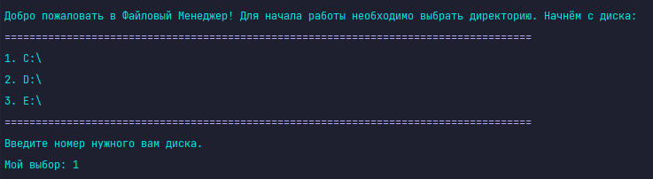

# FileManager
Console file manager that can modify text files

# Features
* Directory selection.
* Get the list of files in selected directory.
* Print the selected text file to console with encodings:
    * UTF-8
    * UTF-16
    * UTF-32
    * ASCII
* Copy, move or delete selected file.
* Make a text file with selected encoding.
* Concatenation of text files.
* Print The Shrek script to console.